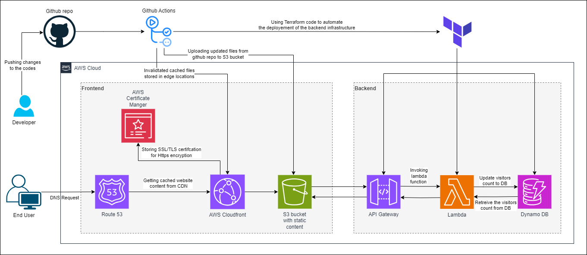

# Naveen raj - AWS Resume
## About The Project
This is my Cloud Resume Challenge built on AWS. It's a static website hosted on AWS S3 bucket, with a visitor counter built on AWS Lambda functions. The website is built with HTML, CSS, and JavaScript. The visitor counter is built with Python and AWS lambda functions. 

## Demo

[View it live here](https://resume.naveenraj.net)

## Structure

- `.github/workflows/`: Folder contains CI/CD workflow configurations.
- `frontend/`: Folder contains the website.
    - `index.html`: file contains frontend website code.
    - `js/visitorcount.js`: file contains visitor counter code to retrieve & update the visitors count.
- `infra/`: Folder contains the infrastructure codes.
    - `lambda/lambda_function.py`: Contains the visitor counter code which is deployed on lambda function.
    - `main.tf`: Contains the backend infrastructure written as terraform code.

## AWS Services Used
- Route 53
- Cloudfront
- S3 bucket
- Certificate Manager
- Lambda function
- API Gateway
- Dynamo DB

## Blog
- https://naveend3v.medium.com/my-cloud-resume-challenge-project-6f726ed58d60